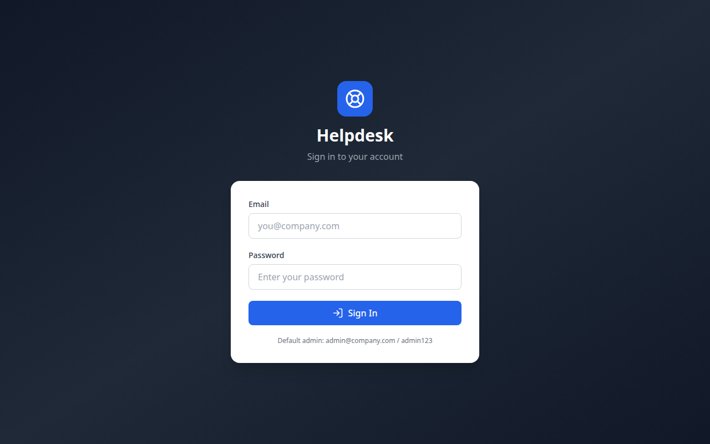
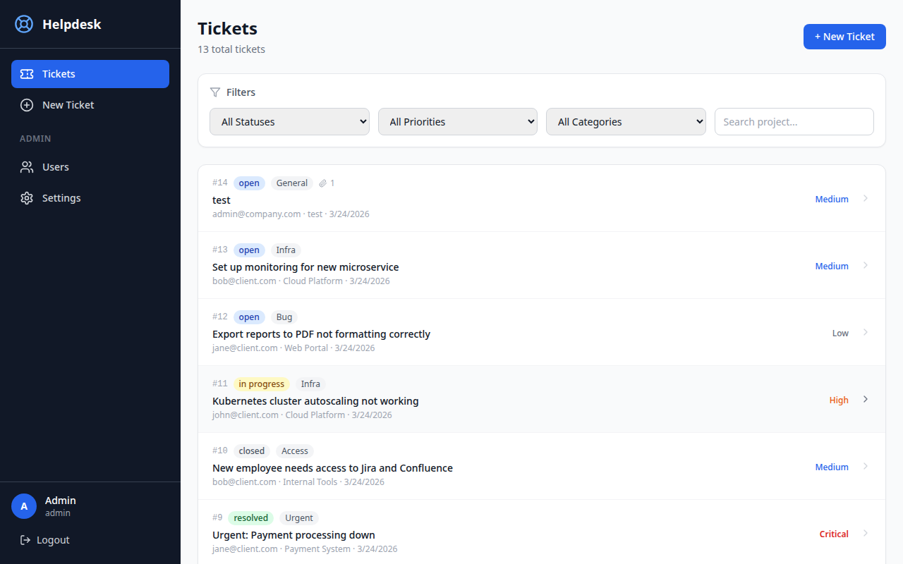
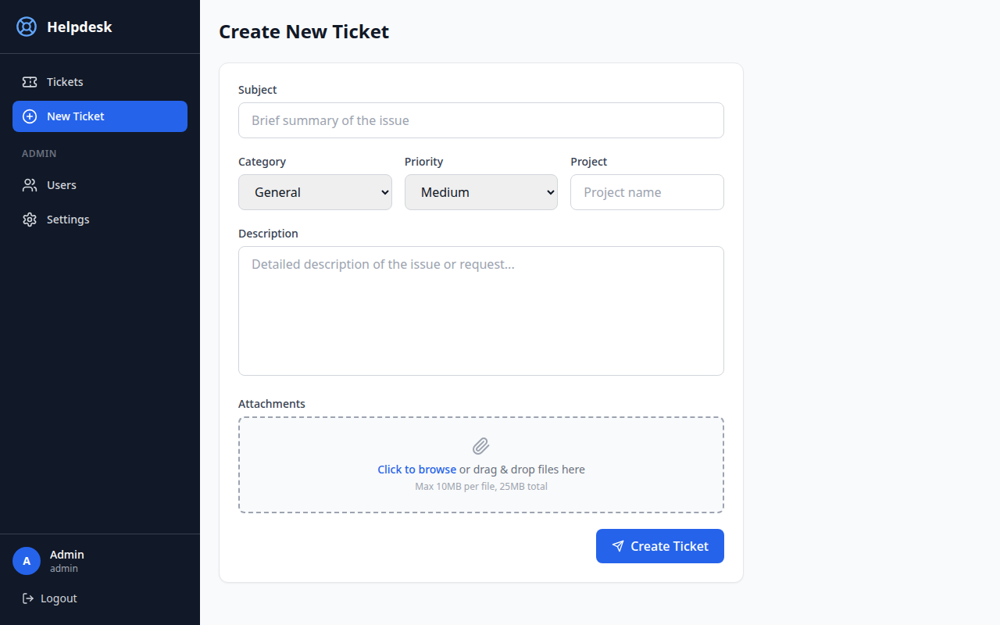
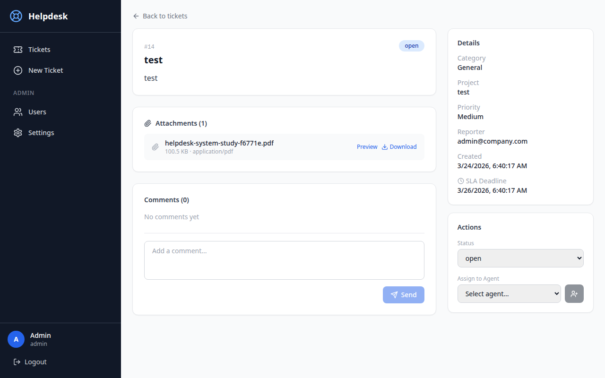
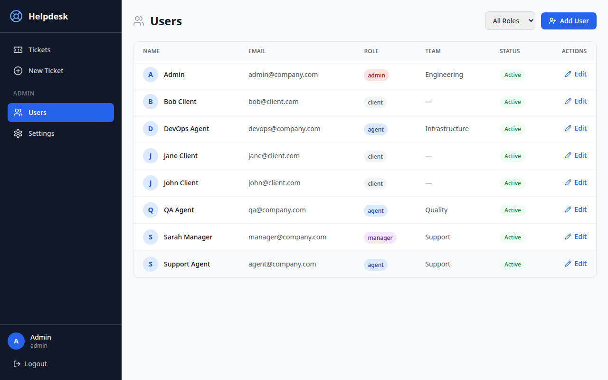
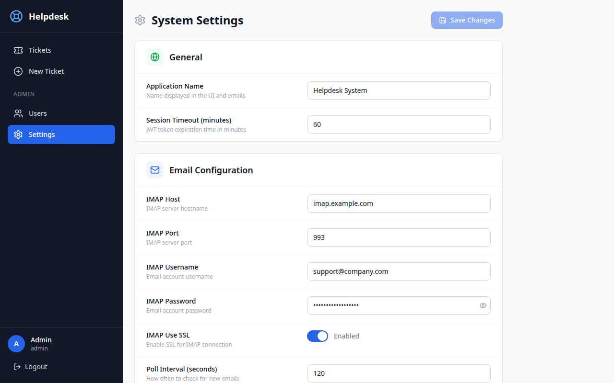

# Helpdesk System

A full-featured helpdesk ticketing system for software development companies. Supports both internal teams and external clients with email-driven ticket creation, a modern web dashboard, role-based access control, file attachments, and dynamic configuration management.



---

## Table of Contents

- [Features](#features)
- [Screenshots](#screenshots)
- [Tech Stack](#tech-stack)
- [Quick Start](#quick-start)
- [Default Users](#default-users)
- [Email Format](#email-format)
- [API Endpoints](#api-endpoints)
- [Project Structure](#project-structure)
- [Local Development](#local-development)
- [Running Tests](#running-tests)
- [User Manuals](#user-manuals)
- [License](#license)

---

## Features

### Ticket Management
- **Create tickets** via web UI or email with category, priority, project, and description
- **File attachments** — Drag & drop or click to upload files when creating tickets (max 10MB per file, 25MB total)
- **Status workflow** — Open → In Progress → Resolved → Closed
- **Priority levels** — Low, Medium, High, Critical
- **Categories** — Bug, Feature, Access, Infra, General, Urgent
- **SLA tracking** — Automatic deadline calculation based on ticket priority
- **Comments** — Threaded conversation on each ticket with email/web source tracking
- **Agent assignment** — Assign tickets to support agents

### Email Integration
- **IMAP polling** — Automatically reads incoming emails and creates tickets
- **Format validation** — Validates subject `[Category]` tag and body structure
- **Auto-reply** — Sends format instructions when email doesn't match required format
- **Email threading** — Replies thread back to existing tickets via In-Reply-To headers
- **Attachment extraction** — Parses and stores email attachments

### User Management
- **Role-based access** — Admin, Manager, Agent, Client roles with different permissions
- **User CRUD** — Create, edit, and deactivate users from the admin UI
- **Quick status toggle** — One-click activate/deactivate users
- **Role filter** — Filter user list by role

### Admin Settings
- **Dynamic configuration** — All system settings editable from the web UI
- **Grouped categories** — Email, Attachments, Auto-Reply, General settings
- **Type-aware inputs** — Toggle switches for booleans, password fields, number inputs
- **Bulk save** — Edit multiple settings and save all at once

### Dashboard & Navigation
- **Modern UI** — Clean, responsive design with TailwindCSS
- **Ticket list** — Filterable, sortable ticket overview with status badges
- **Ticket detail** — Full ticket view with description, attachments, comments, and sidebar actions
- **Role-aware navigation** — Admin/Manager users see Users and Settings in sidebar

---

## Screenshots

| Page | Screenshot |
|------|-----------|
| Login |  |
| Ticket List |  |
| Create Ticket |  |
| Ticket Detail |  |
| User Management |  |
| Admin Settings |  |

> **Note:** To add screenshots, capture each page from the running app and save to `docs/screenshots/`.

---

## Tech Stack

| Layer | Technology |
|-------|-----------|
| Backend | Python 3.11 + FastAPI |
| Frontend | React 18 + TypeScript + TailwindCSS |
| Database | PostgreSQL 16 |
| Task Queue | Celery + Redis |
| Email | IMAP (read) + SMTP (send) |
| Auth | JWT (python-jose) + bcrypt |
| Icons | Lucide React |
| HTTP Client | Axios |
| Container | Docker + Docker Compose |

---

## Quick Start

### 1. Clone and configure

```bash
git clone https://github.com/arunideen/helpdesk.git
cd helpdesk
cp .env.example .env
# Edit .env with your IMAP/SMTP credentials and secrets
```

### 2. Start with Docker Compose

```bash
docker compose up -d
```

This starts all services: **PostgreSQL**, **Redis**, **FastAPI backend**, **Celery worker + beat**, and **React frontend**.

### 3. Initialize database and seed data

```bash
docker compose exec backend python -m app.seed
```

This creates the database tables, seeds default users, SLA policies, system settings, and sample test data (12 tickets, 10 comments, 6 assignments).

### 4. Access the app

| Service | URL |
|---------|-----|
| **Frontend** | http://localhost:5173 |
| **API Docs** | http://localhost:8000/api/docs |
| **Health Check** | http://localhost:8000/api/health |

---

## Default Users

The seed script creates 8 users across all roles:

| Role | Name | Email | Password |
|------|------|-------|----------|
| **Admin** | Admin | admin@company.com | admin123 |
| **Manager** | Sarah Manager | manager@company.com | manager123 |
| **Agent** | Support Agent | agent@company.com | agent123 |
| **Agent** | DevOps Agent | devops@company.com | agent123 |
| **Agent** | QA Agent | qa@company.com | agent123 |
| **Client** | John Client | john@client.com | client123 |
| **Client** | Jane Client | jane@client.com | client123 |
| **Client** | Bob Client | bob@client.com | client123 |

---

## Email Format

Emails sent to the helpdesk address must follow this format:

**Subject:**
```
[Category] Short summary
```
Categories: `Bug`, `Feature`, `Access`, `Infra`, `General`, `Urgent`

**Body:**
```
Project: <project-name>
Priority: Low | Medium | High | Critical
Description:
<detailed description>
```

**Attachments:** Optional. Max 10 MB per file, 25 MB total.
Supported: `png, jpg, jpeg, gif, pdf, doc, docx, xls, xlsx, csv, txt, zip, tar.gz, log`

---

## API Endpoints

### Authentication
| Method | Endpoint | Description |
|--------|----------|-------------|
| POST | `/api/auth/register` | Register new user |
| POST | `/api/auth/login` | Login, get JWT token |

### Users
| Method | Endpoint | Description | Access |
|--------|----------|-------------|--------|
| GET | `/api/users/me` | Current user profile | All |
| GET | `/api/users/` | List users (filterable by role) | Admin, Manager |
| GET | `/api/users/{id}` | Get user by ID | Admin, Manager |
| PUT | `/api/users/{id}` | Update user (name, role, team, status) | Admin |

### Tickets
| Method | Endpoint | Description | Access |
|--------|----------|-------------|--------|
| GET | `/api/tickets/` | List tickets (filtered, paginated) | All (clients see own) |
| POST | `/api/tickets/` | Create ticket | All |
| GET | `/api/tickets/{id}` | Get ticket detail | All (clients see own) |
| PUT | `/api/tickets/{id}` | Update ticket (status, priority, etc.) | Admin, Manager, Agent |
| POST | `/api/tickets/{id}/assign` | Assign agent to ticket | Admin, Manager, Agent |
| GET | `/api/tickets/{id}/comments` | List comments | All (clients see own) |
| POST | `/api/tickets/{id}/comments` | Add comment | All (clients see own) |
| GET | `/api/tickets/{id}/attachments` | List attachments | All (clients see own) |

### Attachments
| Method | Endpoint | Description | Access |
|--------|----------|-------------|--------|
| POST | `/api/attachments/upload` | Upload files to a ticket | All |
| GET | `/api/attachments/{id}/download` | Download attachment | All (token via query param) |

### Settings
| Method | Endpoint | Description | Access |
|--------|----------|-------------|--------|
| GET | `/api/settings/` | List all settings (filterable by category) | Admin, Manager |
| PUT | `/api/settings/` | Bulk update settings | Admin |

### Notifications
| Method | Endpoint | Description | Access |
|--------|----------|-------------|--------|
| GET | `/api/notifications/` | List notifications | All |
| PUT | `/api/notifications/{id}/read` | Mark notification read | All |
| PUT | `/api/notifications/read-all` | Mark all read | All |

---

## Project Structure

```
helpdesk/
├── backend/
│   ├── app/
│   │   ├── main.py                # FastAPI entry point
│   │   ├── config.py              # Settings from .env
│   │   ├── database.py            # SQLAlchemy engine & session
│   │   ├── seed.py                # DB seed script (users, tickets, settings)
│   │   ├── models/                # SQLAlchemy models
│   │   │   ├── user.py            #   User, UserRole
│   │   │   ├── ticket.py          #   Ticket, TicketCategory, Priority, Status
│   │   │   ├── ticket_comment.py  #   TicketComment, CommentSource
│   │   │   ├── ticket_assignment.py #  TicketAssignment
│   │   │   ├── attachment.py      #   Attachment
│   │   │   ├── notification.py    #   Notification
│   │   │   ├── email_log.py       #   EmailLog
│   │   │   ├── sla_policy.py      #   SLAPolicy
│   │   │   └── setting.py         #   Setting (dynamic key-value config)
│   │   ├── schemas/               # Pydantic request/response schemas
│   │   ├── api/                   # Route handlers
│   │   │   ├── auth.py            #   Register, Login
│   │   │   ├── users.py           #   User CRUD
│   │   │   ├── tickets.py         #   Ticket CRUD, comments, assignments
│   │   │   ├── attachments.py     #   Upload, download
│   │   │   ├── settings.py        #   Admin settings
│   │   │   └── notifications.py   #   Notification management
│   │   ├── services/              # Business logic
│   │   ├── email/                 # IMAP/SMTP + email parser
│   │   ├── workers/               # Celery tasks + beat scheduler
│   │   └── utils/                 # Auth (JWT, bcrypt), storage helpers
│   ├── alembic/                   # Database migrations
│   ├── tests/                     # Unit tests
│   ├── requirements.txt
│   └── Dockerfile
├── frontend/
│   ├── src/
│   │   ├── App.tsx                # Routes and auth guard
│   │   ├── main.tsx               # Entry point
│   │   ├── index.css              # TailwindCSS styles
│   │   ├── components/
│   │   │   └── Layout.tsx         # Sidebar navigation, role-based menu
│   │   ├── hooks/
│   │   │   └── useAuth.ts         # JWT auth hook
│   │   ├── pages/
│   │   │   ├── LoginPage.tsx      # Login form
│   │   │   ├── TicketListPage.tsx  # Ticket dashboard with filters
│   │   │   ├── TicketDetailPage.tsx # Ticket view with comments & attachments
│   │   │   ├── CreateTicketPage.tsx # New ticket form with file upload
│   │   │   ├── AdminUsersPage.tsx  # User management (create, edit, toggle)
│   │   │   └── AdminSettingsPage.tsx # System configuration editor
│   │   └── services/
│   │       └── api.ts             # Axios API client
│   ├── package.json
│   ├── vite.config.ts
│   ├── tailwind.config.js
│   └── Dockerfile
├── docs/
│   ├── screenshots/               # App screenshots
│   └── manuals/                   # User manuals by role
│       ├── admin-manual.md
│       ├── manager-manual.md
│       ├── agent-manual.md
│       └── client-manual.md
├── docker-compose.yml
├── .env.example
├── .gitignore
└── README.md
```

---

## Local Development (without Docker)

### Backend

```bash
cd backend
python -m venv venv
source venv/bin/activate
pip install -r requirements.txt

# Start PostgreSQL and Redis locally, then:
uvicorn app.main:app --reload --port 8000
```

### Celery Worker

```bash
cd backend
celery -A app.workers.celery_app worker --loglevel=info
```

### Celery Beat (email polling scheduler)

```bash
cd backend
celery -A app.workers.celery_app beat --loglevel=info
```

### Frontend

```bash
cd frontend
npm install
npm run dev
```

---

## Running Tests

```bash
cd backend
pip install pytest
pytest tests/ -v
```

---

## User Manuals

Detailed user manuals are available for each role:

- [Admin Manual](docs/manuals/admin-manual.md) — Full system access, user management, settings, all tickets
- [Manager Manual](docs/manuals/manager-manual.md) — Team oversight, ticket assignment, user viewing, settings access
- [Agent Manual](docs/manuals/agent-manual.md) — Ticket handling, status updates, comments, assignments
- [Client Manual](docs/manuals/client-manual.md) — Submit tickets, track progress, add comments

---

## License

This project is proprietary. All rights reserved.
